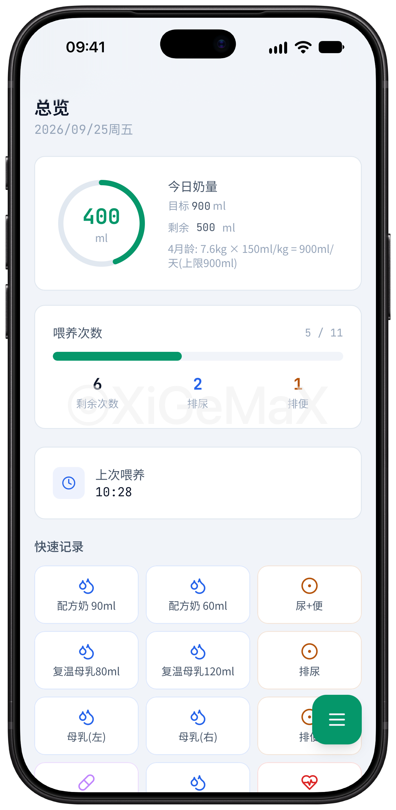
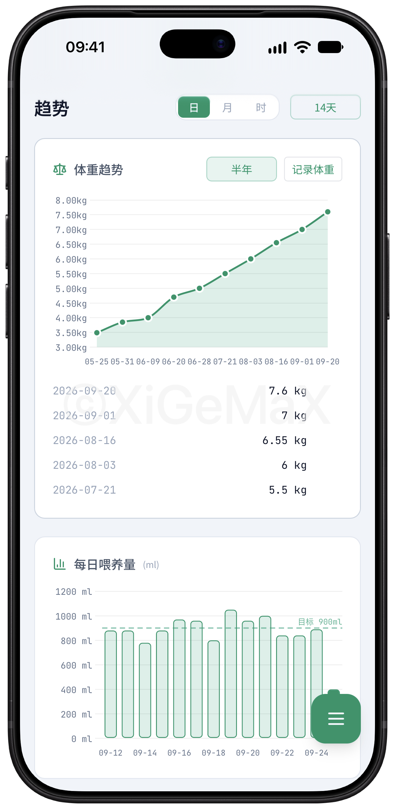
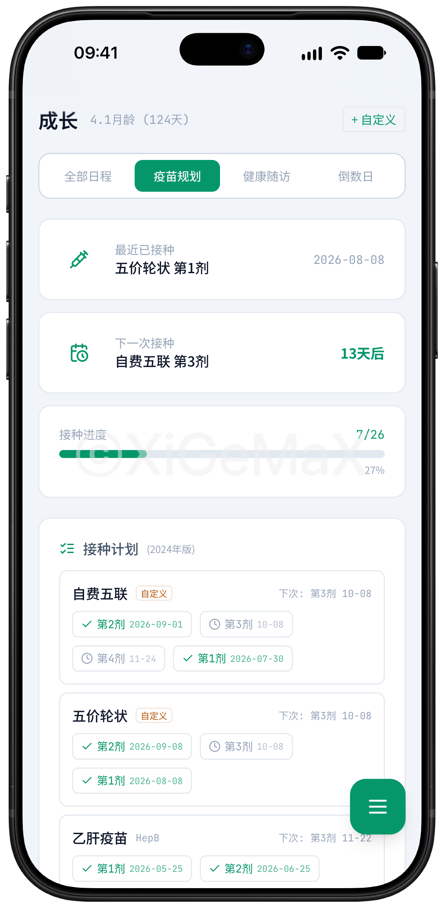

# Baby Tracker for fnOS

[](https://github.com/XiGeMaX/Baby_tracker-fnos/releases/latest)
[](#)
[](#)
[](#)
[](LICENSE)

Baby Tracker 的独立飞牛 fnOS FPK 仓库
应用采用 Flask + Gunicorn 原生运行，支持 x86_64 与 arm64，接入飞牛统一网关和账号体系，数据保存在本地。

## 下载

[**下载最新 FPK**](https://github.com/XiGeMaX/Baby_tracker-fnos/releases/latest) · [查看全部 Releases](https://github.com/XiGeMaX/Baby_tracker-fnos/releases)

每个 Release 包含：

- `baby-tracker.fpk`：飞牛安装包
- `baby-tracker.fpk.sha256`：SHA256 校验文件
- `SOURCE_INFO.txt`：对应源码提交信息

## 功能简介

覆盖日常照护、成长趋势、疫苗规划和家庭自动化，数据全部保存在飞牛本地。

| 功能 | 说明 |
| --- | --- |
| 总览 | 今日奶量目标、喂养次数、尿便次数、上次喂养和快捷记录。 |
| 趋势 | 按日、月或时段查看体重、每日喂养量和目标达成趋势。 |
| 成长 | 疫苗规划、健康随访、自定义日程、倒计时和接种进度。 |
| 家庭共享 | 使用飞牛账号登录，多设备访问同一份本地数据。 |
| Home Assistant | 提供传感器状态、操作按钮和独立 API Key 鉴权。 |

<table>
  <tr>
    <td align="center" width="33%"><a href="docs/screenshots/dashboard.jpg"></a><br><sub>总览</sub></td>
    <td align="center" width="33%"><a href="docs/screenshots/trends.jpg"></a><br><sub>趋势</sub></td>
    <td align="center" width="33%"><a href="docs/screenshots/growth.jpg"></a><br><sub>成长</sub></td>
  </tr>
</table>

## 飞牛适配

- 原生 fnOS 应用，不使用 Docker，支持 x86_64 和 arm64。
- 接入飞牛统一网关、桌面入口和账号体系。
- 首次登录强制设置管理密码，不预置默认管理员。
- SQLite 数据保存在 `data-share`，升级或卸载不会误删数据。
- Python 与前端依赖内置，不依赖公网 CDN。
- 默认仅通过飞牛统一网关访问，可按需开放 TCP 监听。

## 配置指南

| 配置项 | 操作 |
| --- | --- |
| 首次登录 | 从飞牛桌面打开应用，使用当前飞牛账号登录并设置管理密码。 |
| 网络访问 | 默认只通过飞牛统一网关访问；在“管理 > 管理配置”同时填写监听地址和端口后，才开放 TCP 访问。 |
| Home Assistant | 在“管理 > 管理配置”生成 API Key，再按页面生成的 YAML 配置服务地址。 |
| 数据备份 | 数据默认位于 `baby-tracker/data`；建议导出 JSON，直接备份 SQLite 前先停止应用并一并复制 WAL 文件。 |

## 安装与使用

系统要求：fnOS `1.1.3100` 或更高版本。

1. 从 [最新 Release](https://github.com/XiGeMaX/Baby_tracker-fnos/releases/latest) 下载 `baby-tracker.fpk`。
2. 在飞牛应用中心选择“手动安装”，或执行：

```bash
appcenter-cli install-fpk ./baby-tracker.fpk
```

3. 从飞牛桌面打开应用，使用当前飞牛账号登录，并设置管理密码。

数据目录通常对应 `/var/apps/baby-tracker/share/data`。

## 构建与发布

构建要求：`bash`、`git`、`curl`、`jq`、Python 3.12。

```bash
git clone https://github.com/XiGeMaX/Baby_tracker-fnos.git
cd Baby_tracker-fnos
./scripts/build.sh
```

安装包生成到 `dist/baby-tracker.fpk`。使用现有 wheelhouse 离线构建：

```bash
FPK_OFFLINE_WHEELS=1 ./scripts/build.sh
```

推送 `v*` 标签后，[release.yml](.github/workflows/release.yml) 会自动构建、测试并发布 FPK：

```bash
git tag v1.6.7
git push origin v1.6.7
```

标签版本必须与 `packaging/baby-tracker/manifest` 中的 `version` 一致。

## 目录

```text
docs/        README 截图等文档资源
source/      飞牛版源码
packaging/   fnOS 应用包、Manifest、向导和运行资源
scripts/     构建、代码适配和测试脚本
dist/        构建产物
```

## 许可证与上游

- 许可证：[GNU GPL v3](LICENSE)
- 原 Docker 版：[XiGeMaX/Baby_tracker](https://github.com/XiGeMaX/Baby_tracker)
- 本项目为第三方飞牛 fnOS 适配工程，不是飞牛官方项目。
